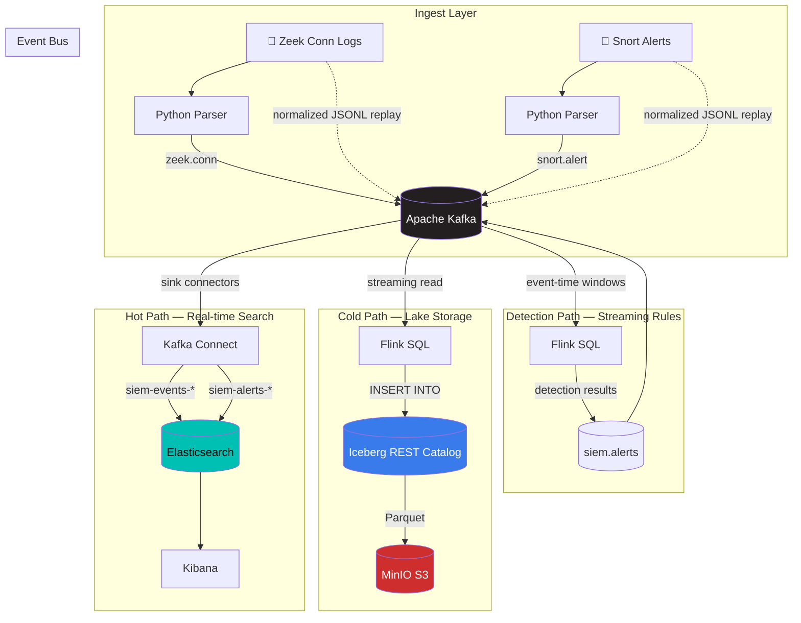
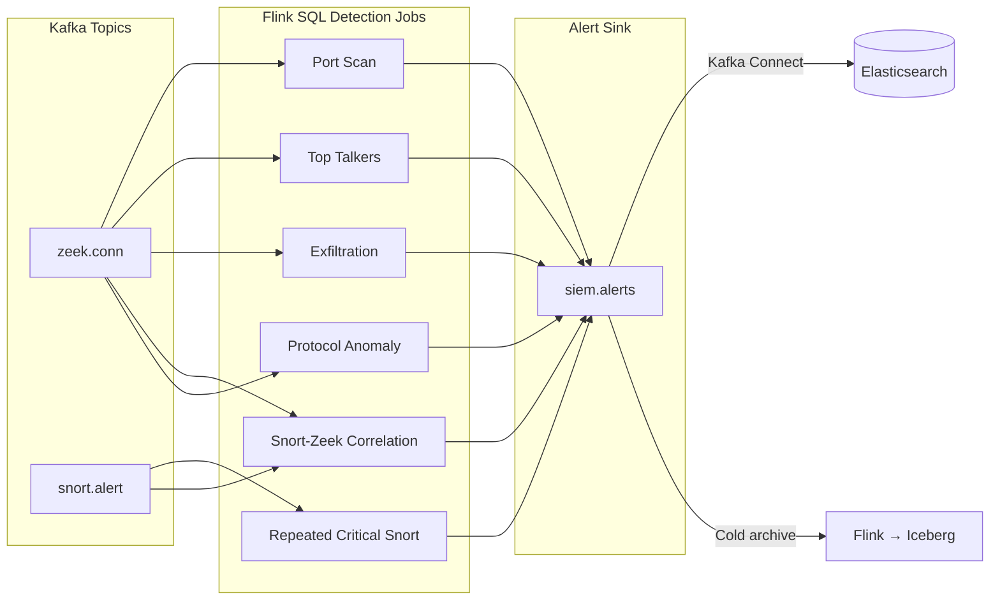

# SIEM Pipeline

<div align="center">

[](https://kafka.apache.org/)
[](https://flink.apache.org/)
[](https://www.elastic.co/elasticsearch/)
[](https://www.elastic.co/kibana/)
[](https://iceberg.apache.org/)
[](https://min.io/)
[](https://www.postgresql.org/)
[](https://docs.docker.com/compose/)
[](LICENSE)

</div>

---

A reproducible, multi-phase SIEM-style data engineering demo built around a Kafka event bus with hot-path search, cold-path lake storage, and streaming detection logic — all orchestrated via Docker Compose.

## Architecture



## Implemented Phases

| Phase | Name | Path | Key Technologies |
|:-----:|------|------|------------------|
| 1 | **Hot Path** | `Kafka → Connect → Elasticsearch → Kibana` | Kafka Connect, Elasticsearch, Kibana saved objects |
| 2 | **Cold Path** | `Kafka → Flink → Iceberg → MinIO` | Flink SQL, Apache Iceberg REST catalog, S3-compatible MinIO |
| 3 | **Detections** | `Kafka → Flink SQL → siem.alerts` | Event-time windows, watermarks, interval joins, 6 rule families |
| 3.5 | **Validation** | Staged smoke tests | Infrastructure checks, topic verification, pipeline assertions |
| 4 | **Reproducibility** | Staged profiles + demo runner | Compose profiles, `run-demo.sh`, bundled datasets |
| 5 | **Benchmarks** | Elasticsearch vs PostgreSQL | Bulk ingest, query latency, concurrent throughput, alert latency |

## Quick Start

```bash
# 1. Clone and configure
cp .env.example .env

# 2. Run the full demo (hot path + cold path + detections)
bash scripts/demo/run-demo.sh full
```

That single command boots the stack, creates Kafka topics, bootstraps Elasticsearch templates and Connect sinks, initializes the Iceberg catalog, launches Flink jobs, replays sample data, and prints verification URLs.

**Minimum requirements:** 4 vCPU / 8 GB RAM. Recommended: 6 vCPU / 12 GB RAM.

## Demo Modes

Run only the layers you need:

| Command | Stack | Use Case |
|---------|-------|----------|
| `bash scripts/demo/run-demo.sh hot-only` | Kafka + ES + Kibana + Connect | Dashboard and search demos |
| `bash scripts/demo/run-demo.sh cold-only` | Kafka + Flink + Iceberg + MinIO | Lake storage and Parquet inspection |
| `bash scripts/demo/run-demo.sh detect-only` | Kafka + Flink | Detection rule development |
| `bash scripts/demo/run-demo.sh full` | Everything | End-to-end pipeline showcase |

With strict smoke validation:

```bash
DEMO_ENABLE_SMOKE_TESTS=1 bash scripts/demo/run-demo.sh full
```

## Docker Compose Profiles

Services are grouped into staged profiles — start only what you need:

```bash
# Hot path only
COMPOSE_PROFILES=hot docker compose up -d --build

# Cold path + detections
COMPOSE_PROFILES=cold,detect docker compose up -d --build

# Full stack + benchmark PostgreSQL
COMPOSE_PROFILES=hot,cold,detect,benchmark docker compose up -d --build
```

| Profile | Services |
|---------|----------|
| (none) | `kafka` — always started, every mode depends on it |
| `hot` | `elasticsearch`, `kibana`, `connect` |
| `cold` | `minio`, `minio-init`, `iceberg-rest` |
| `detect` | `flink-jobmanager`, `flink-taskmanager` |
| `benchmark` | `postgres` |

## Detection Rules

Six streaming detection families, all implemented in Flink SQL with event-time semantics:



Thresholds are configurable via `configs/flink/detection-thresholds.env`.

## Benchmarking

Phase 5 compares Elasticsearch against a PostgreSQL baseline for SIEM-style query workloads:

```bash
# Install benchmark dependency
pip install -r benchmark/requirements.txt

# Run small benchmark (~10K events)
bash scripts/benchmark/run_benchmark.sh small

# Medium (~100K) and large (~1M) scales
bash scripts/benchmark/run_benchmark.sh medium
bash scripts/benchmark/run_benchmark.sh large

# Low-resource mode (laptops / WSL)
BENCHMARK_LOW_RESOURCE=1 bash scripts/benchmark/run_benchmark.sh small
```

Two benchmark suites:
- **`baseline`** — ES vs PG comparison: filters, aggregations, text search
- **`showcase`** — Elasticsearch-specific: multi-field search, faceting, timelines, pivot workflows

Benchmark results are written to `benchmark/results/<run-id>/`. See `docs/benchmark.md` for methodology.

## Distributed Deployment

A 3-node Tailscale cluster deployment is included for the lab cluster (`dvm-sgp-01`, `dvm-sgp-02`, `dvm-sgp-03`):

```bash
bash deploy/distributed/siemctl.sh sync      # sync repo to all nodes
bash deploy/distributed/siemctl.sh tune       # kernel + Docker tuning
bash deploy/distributed/siemctl.sh up         # start the distributed stack
bash deploy/distributed/siemctl.sh bootstrap  # topics, templates, connectors, Iceberg
bash deploy/distributed/siemctl.sh validate   # end-to-end health checks
bash deploy/distributed/siemctl.sh benchmark distributed-1m  # run 1M benchmark
```

Features: Kafka RF=3, 3-node Elasticsearch, distributed Connect workers, remote Flink TaskManagers, PostgreSQL-backed Iceberg catalog, MinIO shared object storage, S3-backed Flink checkpoints.

Full runbook: `docs/distributed-deployment.md`.

## Repository Layout

```text
.
├── benchmark/
│   ├── postgres/init/           # PostgreSQL schema for benchmark baseline
│   ├── requirements.txt         # psycopg for benchmark tooling
│   └── results/                 # Benchmark run outputs (summary + showcase)
├── configs/
│   ├── elasticsearch/templates/ # Index templates for events, alerts, benchmarks
│   ├── flink/                   # Detection threshold env vars
│   ├── kafka/                   # Topic definitions (single-node)
│   ├── kafka-connect/           # ES sink connector configs
│   └── trino/                   # Future Trino catalog (example only)
├── dashboards/                  # Kibana saved objects (NDJSON export)
├── data/
│   ├── sample/                  # Bundled demo datasets (normalized JSONL)
│   └── test/                    # Smoke test fixtures (phase3, phase35)
├── deploy/distributed/          # 3-node Tailscale cluster deployment
│   ├── docker-compose.yml       # Multi-node Compose (Kafka, ES, Flink, MinIO, PG)
│   ├── siemctl.sh              # Cluster control entrypoint
│   ├── configs/                 # Distributed topic + connector configs
│   ├── env/                     # Per-node environment files
│   ├── postgres-init/           # Iceberg catalog schema for PostgreSQL
│   └── scripts/                 # Host tuning
├── docker/
│   ├── connect/Dockerfile       # Kafka Connect + ES sink connector
│   ├── flink/Dockerfile         # Flink + Kafka + Iceberg + Hadoop JARs
│   └── iceberg-rest/Dockerfile  # Iceberg REST catalog + PostgreSQL JDBC
├── docs/                        # Full documentation (see index below)
├── flink/
│   ├── sql/                     # Flink SQL modules
│   │   ├── cold-path/           # Iceberg catalog + table + streaming insert
│   │   ├── detections/          # 6 detection rule families
│   │   ├── demo/               # Named job descriptors per demo rule
│   │   ├── smoke/              # Smoke test job wrappers
│   │   └── benchmark/          # Latency-measurement job name
│   └── usrlib/                  # Flink JARs (kafka connector)
├── parser/                      # Python parsers: Zeek conn + Snort alert → ECS JSON
├── scripts/
│   ├── benchmark/               # Benchmark data prep, load, query, concurrency
│   ├── demo/                    # run-demo.sh, demo.sh, run_distributed_demo.sh
│   ├── lib/                     # Shared shell helpers
│   └── smoke/                   # 5-stage smoke test suite + runner
├── .env.example                 # Central configuration template
├── docker-compose.yml           # Single-node stack (4 profiles)
└── Makefile                     # Convenience targets
```

## Documentation

| Document | Topic |
|----------|-------|
| [`docs/architecture.md`](docs/architecture.md) | Full architecture, service roles, design rationale |
| [`docs/demo.md`](docs/demo.md) | Demo runner usage, modes, validation checklist |
| [`docs/phase1-hot-path.md`](docs/phase1-hot-path.md) | Hot path: Kafka → Connect → ES → Kibana |
| [`docs/cold-path.md`](docs/cold-path.md) | Cold path: Flink → Iceberg → MinIO |
| [`docs/flink-detections.md`](docs/flink-detections.md) | Detection rules: windows, watermarks, joins |
| [`docs/benchmark.md`](docs/benchmark.md) | Benchmark methodology and result interpretation |
| [`docs/distributed-deployment.md`](docs/distributed-deployment.md) | 3-node Tailscale cluster runbook |
| [`docs/validation-smoke-tests.md`](docs/validation-smoke-tests.md) | Smoke test stages and assertions |
| [`docs/roadmap.md`](docs/roadmap.md) | Phase-by-phase implementation plan |
| [`docs/sample-data.md`](docs/sample-data.md) | Sample data format and generation |
| [`docs/references.md`](docs/references.md) | Full references: official docs → repo implementation |
| [`docs/references-slide.md`](docs/references-slide.md) | Condensed reference list for presentation slides |
| [`docs/siem_alert_schema.md`](docs/siem_alert_schema.md) | SIEM alert schema (ECS-normalized) |
| [`docs/snort_alert_schema.md`](docs/snort_alert_schema.md) | Snort alert field mapping |
| [`docs/zeek_conn_schema.md`](docs/zeek_conn_schema.md) | Zeek conn field mapping |

## Verification Commands

After running a demo, use these to confirm the pipeline is healthy:

```bash
# Elasticsearch document counts
curl http://localhost:9200/siem-events/_count
curl http://localhost:9200/siem-alerts/_count

# Flink job overview
curl http://localhost:8081/jobs/overview

# Kafka Connect connectors
curl http://localhost:8083/connectors

# Cold path verification
bash scripts/verify-cold-path.sh

# Detection verification
bash scripts/verify-flink-detections.sh

# Iceberg REST catalog
curl http://localhost:8181/v1/config
```

## Replaying Raw Logs

The demo uses pre-parsed normalized JSONL. To replay raw MACCDC-format logs through the Python parsers:

```bash
pip install -r parser/requirements.txt

# Zeek conn logs
python3 parser/replay_to_kafka.py \
  --input data/raw/zeek/conn.log \
  --topic zeek.conn \
  --bootstrap-servers localhost:9092 \
  --limit 1000 --interval-ms 50

# Snort alert logs
python3 parser/replay_snort_to_kafka.py \
  --input-dir data/raw/snort-alert \
  --topic snort.alert \
  --bootstrap-servers localhost:9092 \
  --limit 1000 --interval-ms 50
```

## Makefile Targets

```bash
make up               # Start the full stack
make down             # Stop everything
make demo             # Run full demo
make demo-hot         # Hot-path only
make demo-cold        # Cold-path only
make demo-detect      # Detections only
make smoke            # Full smoke test suite
make benchmark-small  # Small benchmark run
make logs             # Tail Compose logs
```

## Tech Stack Summary

| Component | Version | Role |
|-----------|---------|------|
| Apache Kafka | 4.1.2 | Central event bus (KRaft mode) |
| Apache Flink | 1.19.2 | Stream processing (SQL) |
| Elasticsearch | 8.17.3 | Hot-path search and aggregation |
| Kibana | 8.17.3 | Dashboards and investigation UI |
| Apache Iceberg | 1.10.1 | Cold-path table format |
| MinIO | RELEASE.2025-04 | S3-compatible object storage |
| PostgreSQL | 17-alpine | Benchmark baseline + Iceberg catalog (distributed) |
| Kafka Connect | 8.1.0 | Elasticsearch sink connectors |
| Docker | Compose v2 | Container orchestration |

## License

MIT
