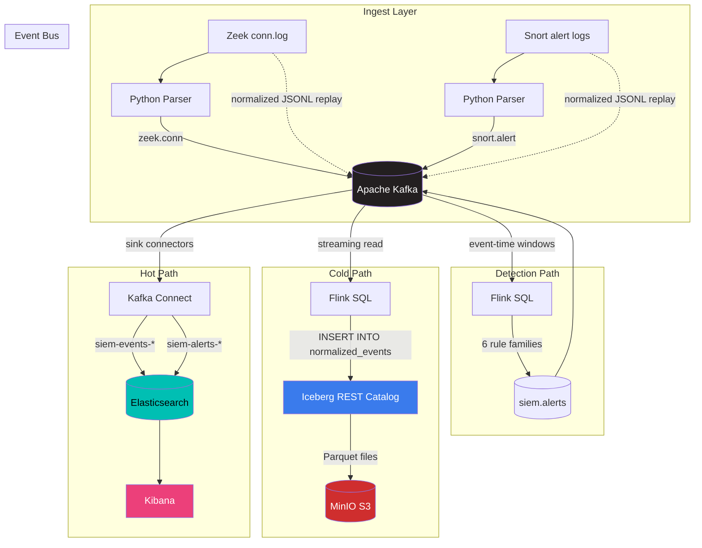

# Architecture

The pipeline keeps Kafka as the central event bus and fans out into three downstream paths:

- **Hot path:** `Kafka → Kafka Connect → Elasticsearch → Kibana`
- **Cold path:** `Kafka → Flink SQL → Iceberg → MinIO`
- **Detection path:** `Kafka → Flink SQL → siem.alerts → Kafka Connect → Elasticsearch`

## Diagram



## End-to-End Flow

```text
Raw Zeek logs ──→ parser/replay ──→ zeek.conn ──────────────────────┐
                                                                      │
Raw Snort logs → parser/replay ──→ snort.alert ──────────────────────┤
                                                                      │
                                                               Kafka Event Bus
                                                                      │
               ┌──────────────────────────────────────────────────────┤
               │                                                      │
               ▼                                                      ▼
       Kafka Connect sinks                                    Flink SQL (cold)
               │                                                      │
               ▼                                                      ▼
         Elasticsearch                                        Iceberg REST Catalog
               │                                                      │
               ▼                                                      ▼
            Kibana                                           MinIO (Parquet)

               ▲
               │
       Kafka Connect sinks
               │
       siem.alerts ◄──── Flink SQL (detections) ◄──── Kafka Event Bus
```

## Service Roles

### Core

- **`kafka`** — Central event bus for normalized events and alerts. KRaft mode, single-node for dev, 3-node for distributed.

### Hot Path (profile: `hot`)

- **`elasticsearch`** — Search and aggregation engine for investigations. Single-node dev, 3-node cluster for distributed.
- **`kibana`** — Dashboards, data views, and saved-object-based investigation UI.
- **`connect`** — Kafka Connect distributed worker with Elasticsearch sink connectors for `zeek.conn`, `snort.alert`, and `siem.alerts`.

### Cold Path (profile: `cold`)

- **`minio`** — S3-compatible object storage for the Iceberg warehouse.
- **`minio-init`** — One-shot container that creates the warehouse bucket.
- **`iceberg-rest`** — REST catalog service. JDBC-backed (SQLite for local dev, PostgreSQL for distributed).

### Processing (profiles: `cold`, `detect`)

- **`flink-jobmanager`** — Flink cluster coordinator, hosts the SQL CLI and REST API.
- **`flink-taskmanager`** — Executes detection and cold-path Flink SQL jobs.

### Benchmark (profile: `benchmark`)

- **`postgres`** — PostgreSQL 17 for Elasticsearch-vs-PostgreSQL benchmark comparison.

## Phase Boundaries

### Phase 1 — Hot Path

Implemented in `docker-compose.yml` (profile `hot`):

- `zeek.conn` and `snort.alert` events flow into `siem-events-*` via Kafka Connect Elasticsearch sinks
- `siem.alerts` is indexed into `siem-alerts-*`
- Kibana provides dashboards imported via saved-object API
- Index templates and write aliases are bootstrapped before indexing starts

Key files:
- `configs/kafka-connect/siem-events-sink.json`
- `configs/kafka-connect/siem-snort-events-sink.json`
- `configs/kafka-connect/siem-alerts-sink.json`
- `configs/elasticsearch/templates/siem-events-template.json`
- `configs/elasticsearch/templates/siem-alerts-template.json`
- `scripts/bootstrap-elasticsearch.sh`
- `scripts/bootstrap-hot-path.sh`

### Phase 2 — Cold Path

Implemented in `flink/sql/cold-path/`:

- Flink SQL reads normalized Kafka topics and streams into Iceberg tables
- Iceberg REST catalog provides a portable catalog contract
- MinIO backs the warehouse with S3-compatible object storage
- A single `normalized_events` table partitioned by `event_date` and `event_dataset`

Key files:
- `flink/sql/cold-path/01_create_iceberg_catalog.sql`
- `flink/sql/cold-path/02_create_iceberg_namespace.sql`
- `flink/sql/cold-path/03_create_iceberg_tables.sql`
- `flink/sql/cold-path/04_create_kafka_sources.sql`
- `flink/sql/cold-path/05_insert_normalized_events.sql`

### Phase 3 — Detections

Six Flink SQL detection rules in `flink/sql/detections/`:

| Rule | File | Technique |
|------|------|-----------|
| Port Scan | `04_detect_port_scan_zeek.sql` | HOP window, COUNT DISTINCT ports/IPs |
| Top Talkers | `05_detect_top_talkers_zeek.sql` | TUMBLE window, SUM bytes |
| Exfiltration | `06_detect_possible_exfiltration_zeek.sql` | HOP window, SUM source bytes |
| Repeated Critical Snort | `07_detect_repeated_critical_snort.sql` | HOP window, COUNT severity ≤ 2 |
| Snort-Zeek Correlation | `08_detect_snort_zeek_correlation.sql` | Interval JOIN on source.ip |
| Protocol Anomaly | `09_detect_protocol_anomalies_zeek.sql` | HOP window, SUM unknown svc bytes |

All rules use event-time processing with watermarks and write results to Kafka topic `siem.alerts`. The base table definitions are in `00_create_detection_base.sql`.

Thresholds are externalized in `configs/flink/detection-thresholds.env`.

### Phase 3.5 — Smoke Validation

Staged verification in `scripts/smoke/`:

1. `01_check_infra.sh` — Docker health, Kafka broker, port reachability
2. `02_verify_kafka_topics.sh` — Topic existence and partition count
3. `03_verify_hot_path.sh` — Elasticsearch indices, document counts
4. `04_verify_cold_path.sh` — Iceberg catalog, MinIO bucket, Parquet files
5. `05_verify_detections.sh` — Flink jobs, siem.alerts messages

### Phase 4 — Reproducibility

Staged Compose profiles, a single `run-demo.sh` entrypoint, and bundled datasets:

- 4 Compose profiles: `hot`, `cold`, `detect`, `benchmark`
- `scripts/demo/run-demo.sh` with modes: `hot-only`, `cold-only`, `detect-only`, `full`
- Bundled tiny normalized datasets in `data/test/phase35/`
- Optional smoke validation with `DEMO_ENABLE_SMOKE_TESTS=1`

### Phase 5 — Benchmark Validation

Elasticsearch-vs-PostgreSQL benchmarking in `scripts/benchmark/`:

- Reproducible data preparation (`small`, `medium`, `large`, `single-1m`)
- Bulk loaders for Elasticsearch and PostgreSQL
- Query latency, concurrent throughput, and ingest benchmarks
- Two suites: `baseline` (ES vs PG) and `showcase` (ES-specific investigations)

## Design Rationale

- **Kafka as the system boundary** — Every path branches from Kafka, not from direct parser output. This keeps ingestion decoupled from processing and storage.
- **Flink for stream processing** — Detection logic and cold-path writes stay in Flink SQL rather than embedding storage-specific sinks in parsers.
- **Kafka Connect for indexing** — Keeps Elasticsearch writes separate from Flink so each component has a single responsibility.
- **Iceberg REST catalog** — Makes the cold path portable beyond local SQLite. In distributed mode, the catalog metadata lives in PostgreSQL.
- **MinIO for object storage** — Mirrors the S3 pattern a production deployment would use, without requiring cloud services.

## Multi-Node Readiness

The architecture's boundaries are intentionally portable from single-node to distributed:

- Replace local SQLite JDBC catalog with PostgreSQL (done in `deploy/distributed/`)
- Point `S3_ENDPOINT_INTERNAL` from local MinIO to a shared S3-compatible endpoint
- Increase Kafka partitions and replication factor via `configs/kafka/topics.env`
- Scale out Flink TaskManagers across nodes
- Store Flink checkpoints and savepoints on S3 (MinIO)
- Keep the Iceberg REST catalog contract so Trino or other engines can query the same tables

The distributed deployment is documented in `docs/distributed-deployment.md` and orchestrated via `deploy/distributed/siemctl.sh`.
