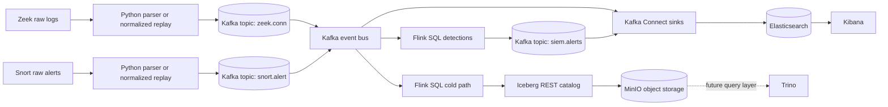

# Architecture

The pipeline keeps Kafka as the central event bus and fans out into three downstream paths:

- hot path: `Kafka -> Kafka Connect -> Elasticsearch -> Kibana`
- cold path: `Kafka -> Flink SQL -> Iceberg -> MinIO`
- detection path: `Kafka -> Flink SQL -> siem.alerts -> Kafka Connect -> Elasticsearch`

## Diagram



## End-To-End Flow

```text
Raw Zeek logs ---> parser/replay ----> zeek.conn -----\
                                                       \
Raw Snort logs --> parser/replay ----> snort.alert ----> Kafka ----> Kafka Connect ----> Elasticsearch ----> Kibana
                                                       /   |\
Flink detections <------------------------------------/    | +----> Flink cold path ----> Iceberg REST ----> MinIO
   |                                                        |
   +----> siem.alerts --------------------------------------+----> future Trino queries / downstream consumers
```

## Phase Boundaries

### Phase 1 Hot Path

- events flow from `zeek.conn` and `snort.alert` into `siem-events-*`
- alerts remain in Kafka topic `siem.alerts` and are also indexed into `siem-alerts-*`
- Kibana provides the demo dashboards and investigation views

### Phase 2 Cold Path

- Flink SQL reads the normalized Kafka topics
- an Iceberg REST catalog keeps the catalog contract portable
- MinIO provides S3-compatible object storage for Parquet-backed Iceberg tables
- the MVP uses one shared Iceberg table partitioned by `event_date` and `event_dataset`

### Phase 3 Detections

Flink SQL implements explainable SIEM detections for:

- Zeek port scans
- Zeek top talkers
- possible Zeek exfiltration
- repeated critical Snort alerts
- Snort-plus-Zeek correlation
- Zeek protocol or service anomalies

All rules write back to Kafka topic `siem.alerts`.

## Phase 4 Reproducibility And Demo Shape

Phase 4 adds a reproducible operator flow instead of changing the logical architecture:

- staged Docker Compose profiles
  - `hot`
  - `cold`
  - `detect`
- a single demo runner: `scripts/demo/run-demo.sh`
- bundled tiny datasets for quick replay
- smoke tests that validate the main integration points

That means the same repo can be used in three ways:

1. quick local lab work with a single stage
2. reproducible server demos with the full stack
3. targeted validation of a single path when resources are limited

## Service Roles

### Core

- `kafka`
  - central bus for normalized events and alerts

### Hot path

- `connect`
  - Elasticsearch sink connectors for `zeek.conn`, `snort.alert`, and `siem.alerts`
- `elasticsearch`
  - search and aggregation for investigations
- `kibana`
  - dashboards and saved-object-based investigations

### Cold path

- `minio`
  - object storage for the Iceberg warehouse
- `minio-init`
  - one-shot warehouse bucket bootstrap
- `iceberg-rest`
  - REST catalog service with a JDBC-backed local catalog

### Processing

- `flink-jobmanager`
- `flink-taskmanager`
  - run both detection and cold-path Flink SQL jobs

## Why This Shape

- Kafka is the system boundary and replay point.
- Flink remains the stream processor instead of writing directly into storage-specific sinks from the parsers.
- Kafka Connect keeps the Elasticsearch indexing layer separate from Flink.
- The Iceberg REST catalog makes the cold path more portable than a filesystem-only lab setup.
- MinIO mirrors the object-storage pattern that a larger deployment would use later.

## Multi-Node Readiness

The current setup is still an MVP, but the boundaries are intentionally portable:

- replace the local SQLite JDBC catalog behind `iceberg-rest` with PostgreSQL or MySQL
- move `S3_ENDPOINT_INTERNAL` from local MinIO to a shared S3-compatible endpoint
- increase Kafka partitions and Flink task slots from `.env`
- move Flink checkpoints to durable shared storage
- keep the Iceberg catalog contract so future Trino or other engines can query the same tables

## Deployment Notes

The repo now supports staged Compose startup:

- `COMPOSE_PROFILES=hot`
- `COMPOSE_PROFILES=cold,detect`
- `COMPOSE_PROFILES=hot,cold,detect`

For an operator-friendly full demo, use:

```bash
cp .env.example .env
bash scripts/demo/run-demo.sh full
```
